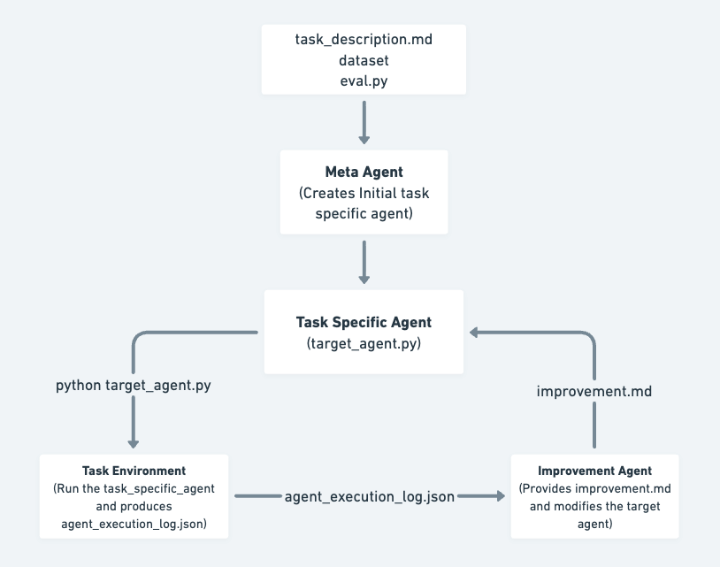

# SIA (Self-Improving Auto-researcher)
Our goal is to build a self-improving AI scientist that can autonomously go ahead and improve its performance on scientific tasks. 

## Results
Below are example results showing progressive improvement of SIA on scientific tasks:

<table width="100%">
  <tr>
    <td width="50%" align="center"><br></td>
    <td width="50%" align="center"><br></td>
  </tr>
</table>

<p align="center"><i>Figure: Model performance plots show the improvement of SIA over multiple generations of self-improvement across tasks.</i></p>


## Overview

<p align="center"></p>
<p align="center"><i>Figure: How the orchestrator runs Meta-, Target, and Feedback agents over successive generations.</i></p>

SIA operates by coordinating three main types of AI agents that work together to continuously improve task performance:

### Glossary
1. **Meta-Agent**: Reads the task description and generates an initial Target Agent tailored to the task.
2. **Target Agent**: Attempts to complete the task and records its actions and results.
3. **Feedback/Improvement Agent**: Reviews the Target Agent's performance logs, identifies improvements, and updates the Target Agent accordingly.

This iterative process allows the system to autonomously refine and enhance its ability to solve scientific tasks.


## Directory Structure

```
sia/
├── sia/
│   ├── orchestrator.py           # Main orchestration logic
│   ├── context_manager.py        # Run/context tracking
│   ├── util.py                   # Agent runner utilities
│   ├── prepare_mlebench_dataset.py    # Dataset preparation script
│   └── tasks/                    # Bundled with the wheel
│       ├── _shared/
│       │   ├── reference_target_agent.py
│       │   └── sample_agent_execution.json
│       └── {task-id}/            # gpqa, lawbench, longcot-chess, spaceship-titanic
│           ├── data/
│           │   ├── public/       # Public dataset
│           │   │   ├── task.md       # Task description
│           │   │   └── *.csv         # Data files
│           │   └── private/      # Private evaluation data
│           └── reference/
│               ├── SAMPLE_TASK_DESCRIPTIONS.md
│               └── reference_target_agent.py
└── runs/                         # Generated during execution
    └── run_{id}/
        ├── venv/                 # Isolated Python environment
        └── gen_{n}/              # Each generation's artifacts
            ├── target_agent.py
            ├── agent_execution.json
            └── improvement.md    # (from gen_2 onwards)
```

## Setup

### Prerequisites

1. **Python 3.11+** with venv support
2. **Create a virtual environment** (recommended):
   ```bash
   python3 -m venv .venv
   source .venv/bin/activate
   ```
3. **Install sia-agent** from PyPI (recommended) — this ships the four built-in tasks with the wheel:
   ```bash
   pip install 'sia-agent[claude]'
   # or, for the OpenHands backend:
   pip install 'sia-agent[openhands]'
   ```

   For development from a clone of this repo:
   ```bash
   pip install -e '.[dev,claude]'
   ```
4. **API Keys**: Set the appropriate API keys based on which backend and models you plan to use:

   **For Claude Code backend (default):**
   ```bash
   export ANTHROPIC_API_KEY="your-anthropic-api-key"
   ```

   **For OpenHands backend with multiple LLMs:**
   ```bash
   # For Claude models via OpenHands
   export ANTHROPIC_API_KEY="your-anthropic-api-key"

   # For Gemini models via OpenHands
   export GOOGLE_API_KEY="your-google-api-key"
   # OR
   export GEMINI_API_KEY="your-gemini-api-key"

   # For GPT models via OpenHands
   export OPENAI_API_KEY="your-openai-api-key"

   # Generic fallback (if specific keys not set)
   export LLM_API_KEY="your-api-key"
   ```

## Example Usage

### Quick start — run a bundled task

The wheel ships with four ready-to-run tasks: `gpqa`, `lawbench`, `longcot-chess`, `spaceship-titanic`.

```bash
sia --task gpqa --max_gen 2 --run_id 1
```

That's it — no clone, no dataset setup. To use a different bundled task, swap the name (e.g., `--task spaceship-titanic`).

### Using SIA to build a custom task

If you want to run SIA on your own dataset, prepare a task directory with the layout below and point `--task_dir` at it.

#### Step 1: Set Up Your Custom Task Directory and Assets

1. **Create the task directory structure:**

   ```bash
   mkdir -p my-tasks/gpqa/{data/public,data/private,reference}
   ```

2. **Add your dataset and task description:**

   - Place your dataset files in the appropriate folders:
     - Public questions:
       ```bash
       cp questions.json my-tasks/gpqa/data/public/
       ```
     - Private answers, ground truths:
       ```bash
       cp answers.json my-tasks/gpqa/data/private/
       ```

     **Note:** The LLM is NOT provided any context about the `private/` folder during evaluation. This prevents cheating and ensures fair assessment.

   - Write the task description in `my-tasks/gpqa/data/public/task.md`.

3. **Copy the reference agent template** (from a clone of this repo):

   ```bash
   cp sia/tasks/_shared/reference_target_agent.py my-tasks/gpqa/reference/
   ```

4. **(Optional) Add sample task descriptions:**
   You may create `my-tasks/gpqa/reference/SAMPLE_TASK_DESCRIPTIONS.md` with examples of similar tasks. This helps the agent generalize better and prevents overfitting to the specific task, if that is your intention.

---

### Step 2: Run the Orchestrator

**Bundled task (Claude backend):**
```bash
sia --task gpqa --max_gen 5 --run_id 1
```

**External custom task:**
```bash
sia --task_dir ./my-tasks/gpqa --max_gen 5 --run_id 1
```

**Using OpenHands with Gemini:**
```bash
sia \
  --task gpqa \
  --max_gen 5 \
  --run_id 1 \
  --backend openhands \
  --meta_model "gemini/gemini-3.1-pro-preview"
```

**Key Arguments:**
- `--task`: Name of a bundled task (`gpqa`, `lawbench`, `longcot-chess`, `spaceship-titanic`). Mutually exclusive with `--task_dir`.
- `--task_dir`: Path to an external task directory. Mutually exclusive with `--task`.
- `--max_gen`: Number of generations to evolve (default: 3)
- `--run_id`: Unique identifier for this run (default: 1)
- `--backend`: Agent backend to use: `claude` (default) or `openhands`
- `--meta_model`: Model for meta/feedback agents (default: `haiku`)

See the [Configuration](#configuration) section below for detailed backend and model options.

**What happens during execution:**

1. **Generation 1:**
   - Meta-agent reads task and creates initial `target_agent.py`
   - Target agent executes task and logs to `agent_execution.json`
   - Feedback agent analyzes and creates improved agent for Gen 2

2. **Generation 2-N:**
   - Target agent from current generation executes task
   - Feedback agent analyzes and creates next generation
   - Continues until `max_gen` is reached

3. **Output:**
   - All artifacts saved in `runs/run_{run_id}/gen_{n}/`
   - Each generation has its own `target_agent.py` and execution logs
   - Improvement notes in `improvement.md`

### Step 3: Analyze Results

```bash
# View execution logs
cat runs/run_1/gen_1/agent_execution.json

# View improvements made
cat runs/run_1/gen_2/improvement.md

# Compare agent versions
diff runs/run_1/gen_1/target_agent.py runs/run_1/gen_2/target_agent.py
```

## Task Requirements

Each task directory must follow this structure:

```
{task-id}/
├── data/
│   ├── public/
│   │   ├── task.md                    # Task description (orchestrator reads this)
│   │   ├── train.csv
│   │   ├── test.csv
│   │   └── sample_submission.csv
│   └── private/
│       └── ...                        # Private evaluation data
└── reference/
    ├── SAMPLE_TASK_DESCRIPTIONS.md    # Similar tasks (for meta-agent context)
    └── reference_target_agent.py      # Template agent structure
```

------

### Running SIA on MLE-Bench task

Use the `prepare_mlebench_dataset.py` script to prepare a task dataset from MLE-Bench:

```bash
python orchestration/prepare_mlebench_dataset.py -c "spaceship-titanic"
```

This will:
1. Run `mlebench prepare -c "spaceship-titanic"`
2. Copy public and private datasets from `~/.cache/mle-bench/data/prepared/`
3. Rename `description.md` to `task.md` in `data/public/`
4. Use Gemini to generate similar tasks (optional)
5. Create `SAMPLE_TASK_DESCRIPTIONS.md` in `reference/`
6. Copy `reference_target_agent.py` from `_shared/` to `reference/`

**Options:**
- `--skip-gemini`: Skip Gemini API call for similar tasks
- `--tasks-dir PATH`: Specify custom tasks directory (default: `./tasks`)


5. Optionally create `SAMPLE_TASK_DESCRIPTIONS.md` manually in `reference/`


------

## Troubleshooting

### "Run directory already exists"
The orchestrator prevents overwriting existing runs. Either:
- Use a different `--run_id`
- Delete the existing run: `rm -rf runs/run_1`

### "No GEMINI_API_KEY environment variable set"
The prepare script will skip similar task generation. Either:
- Set the environment variable: `export GEMINI_API_KEY="your-key"`
- Use `--skip-gemini` flag to skip this step


### Target agent fails during execution
Check the logs in the generation directory:
```bash
cat runs/run_1/gen_1/agent_execution.json
```

Common issues:
- Dataset paths incorrect (ensure absolute paths are used)
- Missing Python packages in the venv
- ANTHROPIC_API_KEY not set

### ImportError: No module named 'anthropic'
The orchestrator creates a fresh venv for each run. If packages are missing:
1. Check the venv creation in the orchestrator logs
2. Manually install: `runs/run_1/venv/bin/pip install anthropic`

## Configuration

### Agent Backend Selection

SIA supports two agent backends for maximum flexibility:

#### 1. Claude Code Backend (Default)
Uses the Claude Agent SDK with Claude models only:

```bash
sia \
  --task gpqa \
  --max_gen 5 \
  --run_id 1 \
  --backend claude \
  --meta_model haiku
```

**Supported Models:**
- `haiku` (claude-haiku-4-5-20251001)
- `sonnet` (claude-sonnet-4-5-20250929)
- `opus` (claude-opus-4-5-20251101)

#### 2. OpenHands Backend
Uses the OpenHands SDK with support for multiple LLM providers:

```bash
sia \
  --task gpqa \
  --max_gen 5 \
  --run_id 2 \
  --backend openhands \
  --meta_model "gemini/gemini-3.1-pro-preview"
```

**Supported Models:**

**Google Gemini:**
```bash
--meta_model "gemini/gemini-3.0-pro"
--meta_model "gemini/gemini-3.1-pro-preview"
```

**OpenAI GPT:**
```bash
--meta_model "openai/gpt-4"
--meta_model "openai/gpt-4-turbo"
```

**Anthropic Claude (via OpenHands):**
```bash
--meta_model "anthropic/claude-sonnet-4-5-20250929"
--meta_model "anthropic/claude-opus-4-5-20251101"
```

### Complete Example: Testing Multiple LLMs

```bash
# Run 1: Claude via Claude Code (default)
sia \
  --task gpqa \
  --max_gen 3 \
  --run_id 1 \
  --backend claude \
  --meta_model haiku

# Run 2: Gemini via OpenHands
sia \
  --task gpqa \
  --max_gen 3 \
  --run_id 2 \
  --backend openhands \
  --meta_model "gemini/gemini-3.1-pro-preview"

# Run 3: GPT-4 via OpenHands
sia \
  --task gpqa \
  --max_gen 3 \
  --run_id 3 \
  --backend openhands \
  --meta_model "openai/gpt-4"
```

### Command-Line Arguments Reference

| Argument | Required | Default | Description |
|----------|----------|---------|-------------|
| `--task` | One of | - | Name of a bundled task (`gpqa`, `lawbench`, `longcot-chess`, `spaceship-titanic`) |
| `--task_dir` | One of | - | Path to an external task directory (mutually exclusive with `--task`) |
| `--max_gen` | No | 3 | Number of improvement generations |
| `--run_id` | No | 1 | Unique run identifier |
| `--backend` | No | `claude` | Agent backend: `claude` or `openhands` |
| `--meta_model` | No | `haiku` | Model for meta and feedback agents |
| `--task_model` | No | `claude-haiku-4-5-20251001` | Model for target agent execution |

### Model Selection

The default model is `haiku` (claude-haiku-4-5-20251001). To use a different model, use the `--meta_model` and `--task_model` arguments as shown above.

**Important Notes:**
- When using the `claude` backend, only Claude model names are supported (`haiku`, `sonnet`, `opus`)
- When using the `openhands` backend, use fully-qualified model names (e.g., `gemini/gemini-3.1-pro-preview`)
- Ensure the appropriate API keys are set in your environment for the models you choose

### Customizing Prompts

Edit the prompts in `orchestrator.py`:
- `META_AGENT_PROMPT`: Controls how the initial agent is created
- `FEEDBACK_AGENT_PROMPT`: Controls how improvements are suggested
