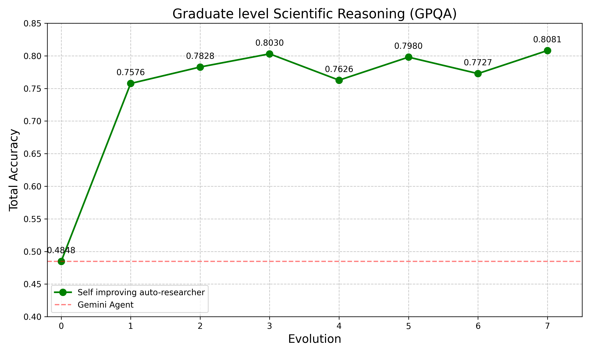
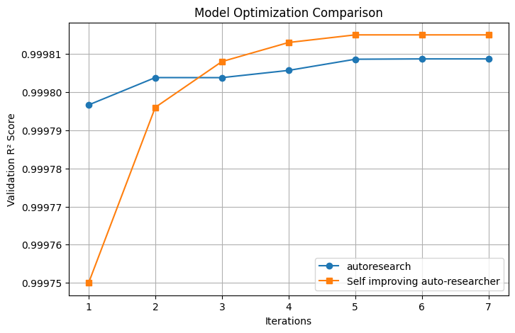

# SIA (Self-Improving Auto-researcher)
Our goal is to build a self-improving AI scientist that can autonomously go ahead and improve its performance on scientific tasks. 

## Results
Below are example results showing progressive improvement of SIA on scientific tasks:

<table width="100%">
  <tr>
    <td width="50%" align="center"><b>GPQA (Graduate-level Science QA)</b><br></td>
    <td width="50%" align="center"><b>ML Agent Experiment</b><br></td>
  </tr>
</table>

<p align="center"><i>Figure: Model performance plots show the improvement of SIA over multiple generations of self-improvement across tasks.</i></p>


## Overview

SIA operates by coordinating three main types of AI agents that work together to continuously improve task performance:

### Glossary
1. **Meta-Agent**: Reads the task description and generates an initial Target Agent tailored to the task.
2. **Target Agent**: Attempts to complete the task and records its actions and results.
3. **Feedback Agent**: Reviews the Target Agent's performance logs, identifies improvements, and updates the Target Agent accordingly.

This iterative process allows the system to autonomously refine and enhance its ability to solve scientific tasks.


## Directory Structure

```
sia/
├── orchestration/
│   ├── orchestrator.py           # Main orchestration logic
│   ├── meta_agent.py             # Meta-agent implementation
│   ├── feedback_agent.py         # Feedback agent implementation
│   └── prepare_mlebench_dataset.py    # Dataset preparation script
├── tasks/
│   ├── _shared/
│   │   ├── reference_target_agent.py
│   │   └── sample_agent_execution.json
│   └── {competition-id}/         # Created by prepare script
│       ├── data/
│       │   ├── public/           # Public dataset
│       │   │   ├── task.md           # Task description
│       │   │   └── *.csv             # Data files
│       │   └── private/          # Private dataset
│       └── spec/
│           ├── SAMPLE_TASK_DESCRIPTIONS.md
│           └── reference_target_agent.py
└── runs/                         # Generated during execution
    └── run_{id}/
        ├── venv/                 # Isolated Python environment
        └── gen_{n}/              # Each generation's artifacts
            ├── target_agent.py
            ├── agent_execution.json
            └── improvement.md    # (from gen_2 onwards)
```

## Setup

### Prerequisites

1. **Python 3.11+** with venv support
2. **Create a virtual environment** (recommended):
   ```bash
   python3 -m venv .venv
   source .venv/bin/activate
   ```
3. **Install required dependencies** from `requirements.txt`:
   ```bash
   pip install -r requirements.txt
   ```
4. **Anthropic API key** set in environment:
   ```bash
   export ANTHROPIC_API_KEY="your-anthropic-api-key"
   ```
5. **Gemini API key** (optional, for similar task generation):
   ```bash
   export GEMINI_API_KEY="your-gemini-api-key"
   ```

## Example Usage

### Using SIA to build SOTA Scientifc Reasoning Agent


#### Step 1: Set Up Your Custom Task Directory and Assets

To create a new custom task (e.g., for GPQA), follow these streamlined steps:

1. **Create the task directory structure:**

   ```bash
   mkdir -p tasks/gpqa/{data/public,data/private,spec}
   ```

2. **Add your dataset and task description:**

   - Place your dataset files in the appropriate folders:
     - Public questions:
       ```bash
       cp questions.json tasks/gpqa/data/public/
       ```
     - Private answers, ground truths:
       ```bash
       cp answers.json tasks/gpqa/data/private/
       ```

     **Note:** The LLM is NOT provided any context about the `private/` folder during evaluation. This prevents cheating and ensures fair assessment.

   - Write the task description in `tasks/gpqa/data/public/task.md`.  
     Example content:
     ```markdown
     # GPQA - General Purpose Question Answering

     Answer graduate-level science questions across physics, chemistry, and biology.
     Each question has multiple choice answers. Select the correct answer.

     ## Data Format
     - questions.json: Contains questions with multiple choice options
     ```

3. **Copy the reference agent template:**

   ```bash
   cp tasks/_shared/reference_target_agent.py tasks/gpqa/spec/
   ```

4. **(Optional) Add sample task descriptions:**
   You may create `tasks/gpqa/spec/SAMPLE_TASK_DESCRIPTIONS.md` with examples of similar tasks. This helps the agent generalize better and prevents overfitting to the specific task, if that is your intention.

---

### Step 2: Run the Orchestrator

```bash
python orchestration/orchestrator.py --task_dir ./tasks/gpqa --max_gen 5 --run_id 1
```

**Arguments:**
- `--task_dir`: Path to the task directory (e.g., `./tasks/spaceship-titanic`)
- `--max_gen`: Number of generations to evolve (default: 3)
- `--run_id`: Unique identifier for this run (default: 1)

**What happens during execution:**

1. **Generation 1:**
   - Meta-agent reads task and creates initial `target_agent.py`
   - Target agent executes task and logs to `agent_execution.json`
   - Feedback agent analyzes and creates improved agent for Gen 2

2. **Generation 2-N:**
   - Target agent from current generation executes task
   - Feedback agent analyzes and creates next generation
   - Continues until `max_gen` is reached

3. **Output:**
   - All artifacts saved in `runs/run_{run_id}/gen_{n}/`
   - Each generation has its own `target_agent.py` and execution logs
   - Improvement notes in `improvement.md`

### Step 3: Analyze Results

```bash
# View execution logs
cat runs/run_1/gen_1/agent_execution.json

# View improvements made
cat runs/run_1/gen_2/improvement.md

# Compare agent versions
diff runs/run_1/gen_1/target_agent.py runs/run_1/gen_2/target_agent.py
```

## Task Requirements

Each task directory must follow this structure:

```
tasks/{competition-id}/
├── data/
│   ├── public/
│   │   ├── task.md                    # Task description (orchestrator reads this)
│   │   ├── train.csv
│   │   ├── test.csv
│   │   └── sample_submission.csv
│   └── private/
│       └── ...                        # Private evaluation data
└── spec/
    ├── SAMPLE_TASK_DESCRIPTIONS.md    # Similar tasks (for meta-agent context)
    └── reference_target_agent.py      # Template agent structure
```

------

### Running SIA on MLE-Bench task

Use the `prepare_mlebench_dataset.py` script to prepare a task dataset from MLE-Bench:

```bash
python orchestration/prepare_mlebench_dataset.py -c "spaceship-titanic"
```

This will:
1. Run `mlebench prepare -c "spaceship-titanic"`
2. Copy public and private datasets from `~/.cache/mle-bench/data/prepared/`
3. Rename `description.md` to `task.md` in `data/public/`
4. Use Gemini to generate similar tasks (optional)
5. Create `SAMPLE_TASK_DESCRIPTIONS.md` in `spec/`
6. Copy `reference_target_agent.py` from `_shared/` to `spec/`

**Options:**
- `--skip-gemini`: Skip Gemini API call for similar tasks
- `--tasks-dir PATH`: Specify custom tasks directory (default: `./tasks`)


5. Optionally create `SAMPLE_TASK_DESCRIPTIONS.md` manually in `spec/`


------

## Troubleshooting

### "Run directory already exists"
The orchestrator prevents overwriting existing runs. Either:
- Use a different `--run_id`
- Delete the existing run: `rm -rf runs/run_1`

### "No GEMINI_API_KEY environment variable set"
The prepare script will skip similar task generation. Either:
- Set the environment variable: `export GEMINI_API_KEY="your-key"`
- Use `--skip-gemini` flag to skip this step


### Target agent fails during execution
Check the logs in the generation directory:
```bash
cat runs/run_1/gen_1/agent_execution.json
```

Common issues:
- Dataset paths incorrect (ensure absolute paths are used)
- Missing Python packages in the venv
- ANTHROPIC_API_KEY not set

### ImportError: No module named 'anthropic'
The orchestrator creates a fresh venv for each run. If packages are missing:
1. Check the venv creation in the orchestrator logs
2. Manually install: `runs/run_1/venv/bin/pip install anthropic`

## Configuration

### Model Selection

The default model is `haiku` (claude-haiku-4-5-20251001). To use a different model:

1. Edit `orchestrator.py`:
   ```python
   asyncio.run(run_agent(
       model_name="sonnet",  # Change here
       max_turns="20",
       prompt=META_AGENT_PROMPT,
       agent_working_directory=META_AGENT_WORKING_DIRECTORY
   ))
   ```

2. Update the META_AGENT_PROMPT to specify the model for target agents

### Customizing Prompts

Edit the prompts in `orchestrator.py`:
- `META_AGENT_PROMPT`: Controls how the initial agent is created
- `FEEDBACK_AGENT_PROMPT`: Controls how improvements are suggested
